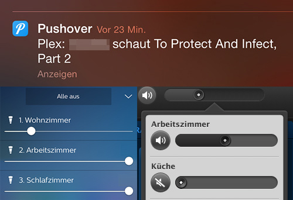
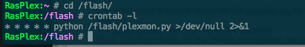

# PlexMonitor
python-script to monitor plex-activity, send iOS-Push-Notification and control Sonos plus Philips HUE

 
## What it does: 
The Cronjob runs every minute on the Pi / Synology and has no noticeable impact on performance.

It checks if there is an active Plex-Session. If yes, it logs the session (timestamp connected user, show/movie-title) and sends a push-notification to an iOS device using [pushover](https://pushover.net/). 

If you are the user with the active session, the script reduces the brightness of your Philips HUE lightbulbs in the living-room and sets the Volume of the Sonos speaker in the living-room to zero. 

If the script has already seen the active session it will not try to notify you (or control the lights/audio) again - until three hours have passed. Thus it will work again the next day, if i resume a show which i quit a day earlier after just having watched half of it.  

## What inside: 
* The script itself is heavily based on the [plexMon.py](https://github.com/vwieczorek/plexMon/blob/master/plexMon.py) by Victor Wieczorek. 
* The [SoCo-Library](https://github.com/SoCo/SoCo) controls the Sonos Speaker. 
* [Phue](https://github.com/studioimaginaire/phue), a Python library for the Philips Hue system, is controlling the light. 
 
 
## Use: 
Setup a cron with crontab: 

This is a typical logfile-Entry if friends are watching

    2014-09-19 15:23:11 Tony watches A Great Hollyday in Sweden
 
This is a Logfile-Entry with actions, if I have an active session
    
    2014-09-20 16:43:31 JohnDow watches To Protect And Infect, Part 2
    2014-09-20 16:43:32 Attempting to connect to the bridge...
    2014-09-20 16:43:32 Using ip: 192.168.1.109
    2014-09-20 16:43:32 Using username from config:     2f724e2f724e2f724e2f724e
    2014-09-20 16:43:32 Sending SetVolume [(u'InstanceID', 0), (u'Channel', u'Master'), (u'DesiredVolume', 0)] to 192.168.1.105
    2014-09-20 16:43:32 Starting new HTTP connection (1): 192.168.1.105
    2014-09-20 16:43:32 Received status 200 from 192.168.1.105
 
## Notes
* A plexpass-subscription to read the active sessions from the Plex-Server is required.
* The Pushover-App works fine, but will have a one-time-purchase after a brief trial-period
* The HUE-Bridge has to be manually paird on first run (hit the button on the bridge)
* I tried to pause the sonos-speaker but settled on the mute commando. I just wanted the living-room Speaker to be silent. But if i send him the pause-commando while he was part of a sonos zone, i would have been required to unjoin him beforehand, which is a bit tricky, because it can throw an exception if i would blindly send the unjoin-commando and the speaker is currently not in a zone. So i just mute him.